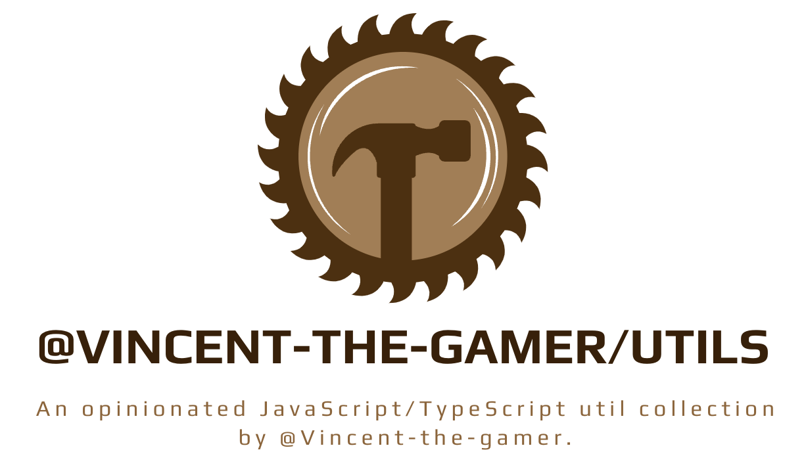

    

<h1 align="center">@vincent-the-gamer/utils</h1>

    An opinionated JavaScript/TypeScript util collection by
    <a href="https://github.com/Vincent-the-gamer" target="_blank">@Vincent-the-gamer</a>

    
    
    

# Installation
<pre align='center'>
npm i <b>@vincent-the-gamer/utils</b>
</pre>

# Documentation
Visit docs at [https://utils.vince-g.xyz](https://utils.vince-g.xyz)

# License
[MIT License @Vincent-the-gamer 2024-PRESENT](./LICENSE)